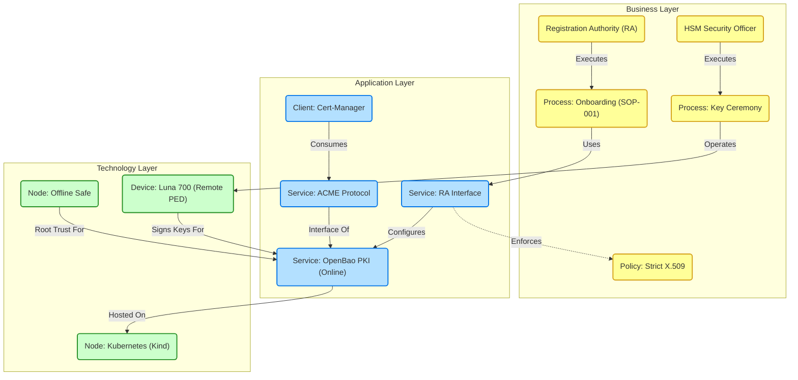

# PKI Architecture (Archimate View)

This document visualizes the Energy Corp PKI using Archimate notation (via Mermaid).

## Interpretation
1.  **Business Layer**: The **RA** executes the **Onboarding Process**, translating business requirements into technical policies. The **HSM SO** executes the **Key Ceremony**.
2.  **Application Layer**: **OpenBao** serves as the central PKI engine, exposing **ACME** for automation (consumed by `cert-manager`) and API endpoints for RA management.
3.  **Technology Layer**: The system rests on **Kubernetes**, but relies on the physical **Luna 700 HSM** (accessed via Remote PED) and the **Offline Root** (Safe) for high-assurance trust anchors.
